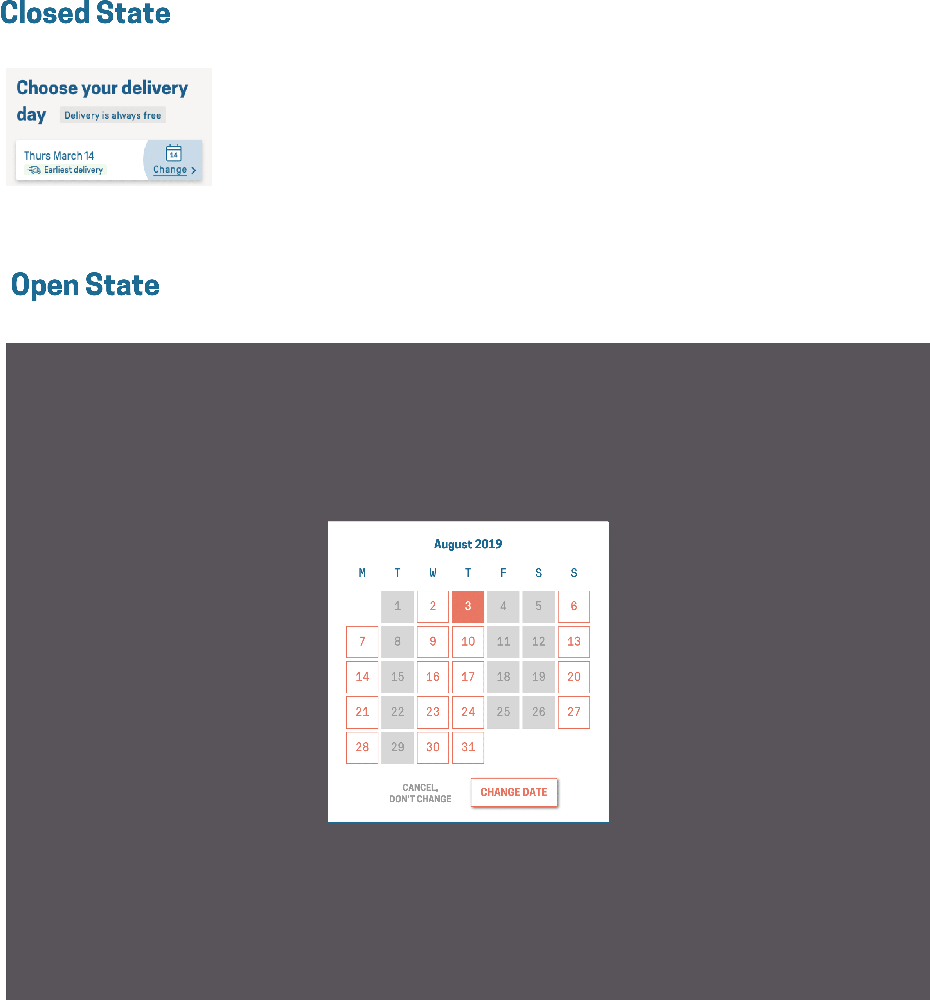

# Calendar Task

## Introduction

During our signup process, it's important to us that customers are able to select their preferred delivery date so they see how flexible the service we offer is. This step is done on our checkout, and is composed of a pre-selected date (Which is the earliest available delivery), and a prompt to allow them change it. Clicking on this prompt opens up a modal that allows them select a new date for delivery.

We'd like you replicate some of this functionality for us.

## Task

We’d love for you to create a simple calendar view outlined in the PDF attached below in React and CSS, similar to the approach we take on checkout.

As we've outlined in the image below, the initial state should be a button that opens a modal with a background overlay greying out the background.

Once clicked, a modal animates in and I should be able to adjust my delivery date to another 'deliverable' date. For dates that are 'un-deliverable' (Tuesdays, Fridays and Saturdays) they should not be selectable by the user and should not be set as an initial delivery date.

Clicking on the 'change date' button, 'cancel, don't change' button, or the background, should close the modal after saving the user option if appropriate.

The dates listed should show the current month. You should correctly dynamically handle the start date and end date of the month being any day of the week.

Some notes:

1. We’re keen to ensure that it’s a collaborative effort - feel free to check in regularly to
discuss any aspect of the project.
2. The modal should only be rendered on the page (added to the DOM) when open. We don't want extra HTML nodes hanging around on the page when it's closed. Think about how this might impact the animation of the item.
3. Further animation beyond the opening and closing of the modal and any other ideas you have to improve the user experience and show off your attention to detail would be a great bonus!
4. You can only select one date at a time in the calendar.
5. You are free to use animation libraries, within reason.
6. The date in the calendar icon in the closed state should be dynamic and reflect the selected date.

## UI Design

## Other notes

- We've included some assets that you'll need such as SVGs, fonts, and our colours. We're interested in seeing how you organise the project's folder structure so we've left that up to you.

- Comments and documentation are always appreciated as part of the submission.

## Tooling

We've set up a basic Create React App. We've also set up TypeScript and Sass as tools that you can use, but feel free to adjust if you prefer a different setup.

## Getting started

To get started with the task, ensure you have both `node` and `yarn` installed locally on your machine and both commands are available to be called.

1. Install the required dependencies with `yarn install`
2. Start the development server by running `yarn start`
3. Once the server starts successfully, you should be able to view the task on `http://localhost:3000/`

## Technical Requirements

To be able to build the task, ensure your local Node and Yarn versions match the current supported version requirements:

- Node >= v14.17.0
- Yarn >= v1.22

To easily control your `node` version and easily switch between them, we recommend installing [NVM](https://github.com/nvm-sh/nvm) and using that to install and easily switch to a different version.

You can find out your current Node version by running `node --version` in your terminal.

> **_Important:_** External packages can be used to acomplish this task although the submitted solution needs to match the UI design and functionality required as per the task description. 

